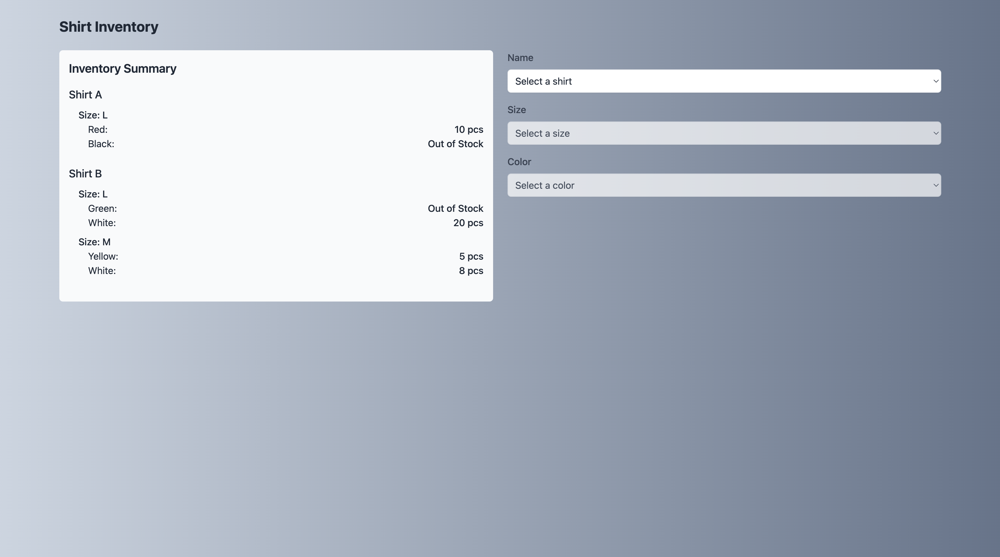

# Stock Items Apps

tech stack: Nuxt 3, Vue 3, Pinia, Tailwind CSS, TypeScript

## Description

This is a simple stock items application built with Nuxt 3, Vue 3, Pinia, Tailwind CSS, and TypeScript. It allows users to view and manage stock items in a user-friendly interface.

## Features

- View stock items

## Screenshot

### First Landing



### Out Of Stock


### Ready Stock


## Setup Installation

Make sure to install dependencies:

```bash
# npm
npm install

# pnpm
pnpm install

# yarn
yarn install

# bun
bun install
```

## Local Development Server

Start the development server on `http://localhost:3000`:

```bash
# npm
npm run dev

# pnpm
pnpm dev

# yarn
yarn dev

# bun
bun run dev
```

```

```
